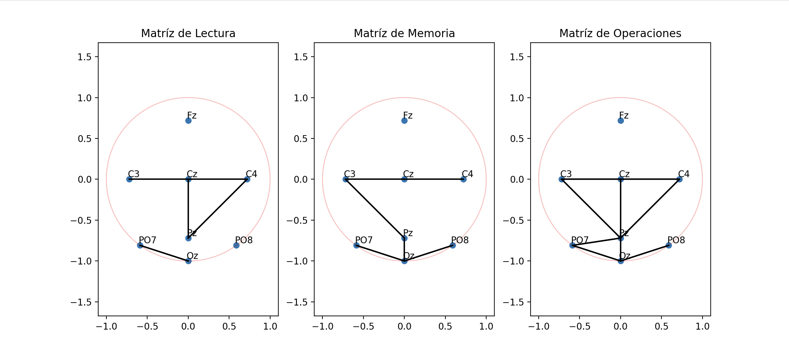
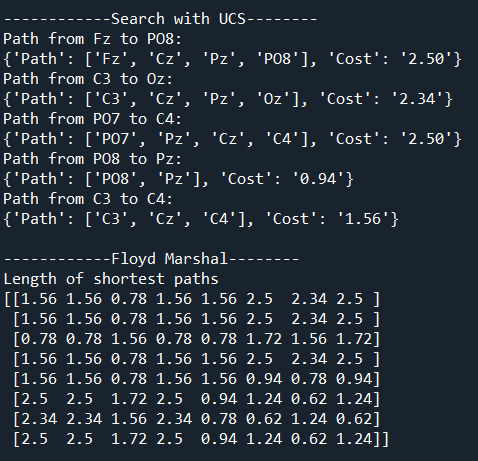
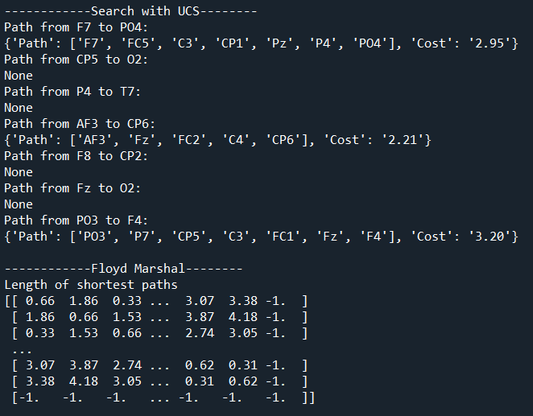
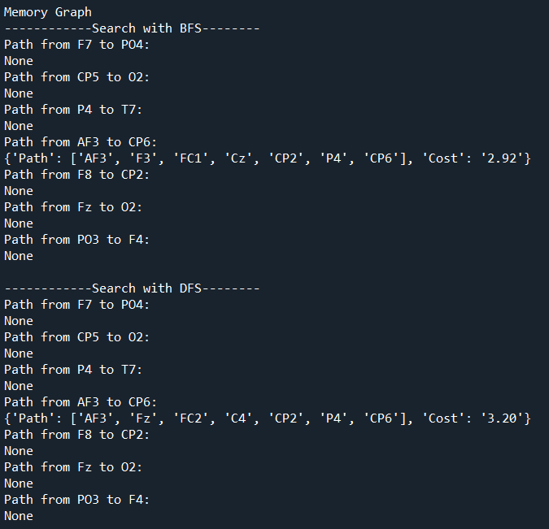
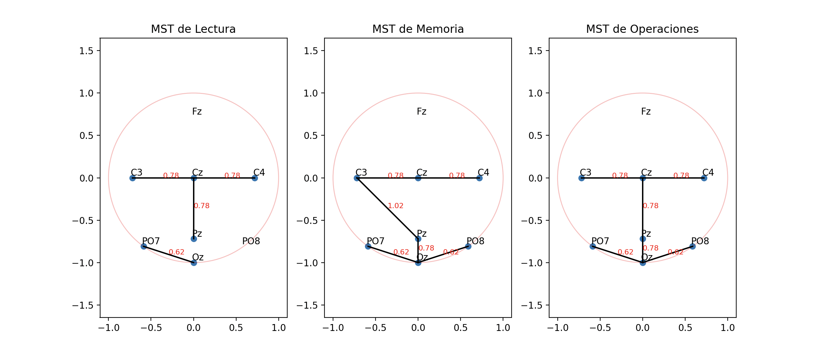

# Brain_Graph_Manipulation

## Introducción

### Descripción de la situación problema

El cerebro humano es como una red de neuronas que trabajan juntas para procesar información, generar pensamientos y coordinar acciones. A través de técnicas como la resonancia magnética funcional (fMRI) y la electroencefalografía (EEG), los científicos han avanzado en la comprensión de la actividad cerebral. 

Se destaca el uso de EEG, una técnica no invasiva y asequible que mide la actividad eléctrica cerebral, con electrodos colocados en el cuero cabelludo. La conectividad funcional en el EEG, que evalúa la correlación temporal entre las señales de diferentes regiones cerebrales, revelando cómo colaboran en tareas cognitivas.

Para el análisis de la conectividad funcional, se construye un grafo de conectividad que indica qué áreas colaboran en una tarea y en qué grado. El análisis de dicho grafo se realiza con técnicas computacionales clásicas, tales como recorridos en grafos, así como técnicas matemáticas avanzadas relacionadas con el manejo de grafos.

En esta situación problema nosotros seremos capaces de responder a las siguientes preguntas:

- ¿Qué algoritmos relacionados con grafos puedes utilizar para analizar una red de conectividad funcional?
- ¿De qué forma puedes visualizar el grafo de conectividad de tal forma que sea fácil de entender?
- ¿Qué dificultades hay en el análisis del grafo de conectividad?

 

|  |  |

 

Durante estas últimas 5 semanas hemos realizado el experimento del EEG sobre nosotros en 3 diferentes áreas, las cuales fueron: Capacidad de Memoria, Capacidad de Resolución de Operaciones y Capacidad de Lectura

 
Los resultados obtenidos fueron recibidos como una matriz de adyacencia de 0's y 1's para entender y poder graficar las conexiónes de cada uno de nuestros cerebros.

 

 

A continuación las etapas del proyecto:

## Etapa 01 - Registro de Señales de EEG

En esta etapa, participamos en una sesión experimental de neurociencia en la que se midió nuestra actividad cerebral utilizando un dispositivo de EEG (Unicorn Hybrid Black).

Durante la sesión, realizamos tres tipos de tareas cognitivas: lectura, memoria y operaciones matemáticas. Mientras realizamos estas tareas, se registró nuestra actividad cerebral, generando archivos de datos. Estos datos son representados como matrices que a su vez son grafos no ponderados que indican la presencia de una relación fuerte entre canales.

Graficamos todos los grafos de conectividad en 2D.

### Grafos de conectividad

#### Juan's Connectivity Graph

#### Diego's Connectivity Graph

#### Fer's Connectivity Graph

#### Jesus's Connectivity Graph

#### General S0A Graph Connected

## Etapa 02 - Análisis de caminos en los grafos de conectividad 

La etapa implica la transformación de grafos, la búsqueda de caminos utilizando diferentes métodos y la aplicación del algoritmo de Floyd para analizar las distancias mínimas entre todos los electrodos en los grafos

- Conversión a Grafos Ponderados
- Búsqueda de Caminos con BFS, DFS y Búsqueda de Costo Uniforme
- Búsqueda de Caminos para Grafo de 32 Electrodos
- Método de Floyd para Distancias Mínimas

### Caminos encontrados Juan:

### Caminos encontrados Diego:

### Caminos encontrados Jesús:

### Caminos encontrados Fer:

### Caminos encontrados General:

### Ejemplos de rutas

Las siguientes rutas se encontraron en la matriz de Fer, usando la carpeta 16 y en la matriz general

### ¿Qué diferencias observas entre los resultados obtenidos por los diferentes métodos de búsqueda?
- Hay muchas búsquedas que no tienen rutas, pero en las que se encuentran la diferencia está en el peso de la ruta. La búsqueda de costo uniforme siempre da el resultado con la ruta más corta y los demás pueden dar esa misma solución, pero no siempre lo hacen.
### ¿Qué utilidad encuentras a los resultados obtenidos por el método de Floyd? ¿Qué información consideras que le falta mostrar?
- Podemos saber cuáles son los pares de electrodos que se encuentran conectados. Le faltaría mostrar la longitud total del camino e información extra sobre los nodos como qué electrodos son y alguna descripción de cómo ayudan en el cuerpo. 
### ¿Por qué crees que es importante saber si hay rutas entre pares de electrodos?
- Para saber cuáles son los electrodos que se conectan y poder hacer el análisis correcto de los resultados. Si 2 electrodos están conectados a la hora de hacer una actividad, entonces esos 2 se usan o se comunican para realizarla.

## Etapa 03 - Análisis de árboles de mínima expansión de los grafos de conectividad

### Árboles de mínima expansión - Juan

### Árboles de mínima expansión - Diego

### Árboles de mínima expansión - Jesús

### Árboles de mínima expansión - Fer

### Árboles de mínima expansión - General

### ¿Qué utilidad ves en el uso de árboles de expansión mínima para representar los grafos de conectividad?
- El uso de árboles de mínima expansión para representar grafos puede ser muy útil dentro de varios campos. Se pueden ver aplicados desde áreas como redes y enrutamiento (encontrar un árbol de expansión mínima 
  dentro de las conexiones de una red para enviar paquetes rápidamente) hasta transporte (encontrar las rutas más corta entre dos ubicaciones para optimizar tiempo y recursos). En este caso aplicar un MST para    el grafo de conectividad cerebral puede ser útil para identificar las conexiones mas próximas entre electrodos y como es que se puede simplificar las conexiones.
  
### ¿Encuentras diferencias gráficas entre las tareas para cada miembro del equipo?
- En las tareas de lectura, solamente un MST involucra el electrodo Fz, mientras que en otros casos no hay conexiones entre Pz y Oz, P8 y Oz y P7 Oz. Por su parte, la matriz de memoria es la que más similitudes 
  presenta entre todos los sujetos, salvo por un par de conexiones como de Pz a C3 en lugar de Pz a Cz, o de Cz a Fz. Lo anterior sucede de la misma forma para el MST de operaciones 
### ¿Ocurre lo mismo con el gráficos para los datos con 32 canales?
- Al ser de 32 canales, este es el MST en el que se nota más la reducción de conexiones como resultado de la aplicación del algorimo de Kruskal
En esta etapa, se realiza la búsqueda de árboles de expansión mínima utilizando los grafos de conectividad no ponderados.

## Etapa 04 - Cascos convexos de los vértices de los árboles de mínima expansión

### Cascos Convexos - Juan

### Cascos Convexos - Diego

### Cascos Convexos - Jesús

### Cascos Convexos - Fer

### Cascos Convexos - General

En esta etapa, se lleva a cabo la búsqueda de los cascos convexos para los vértices de cada árbol de expansión mínima

### ¿Qué utilidad vez en el uso de cascos convexos para representar los grafos de conectividad?
- Observando el casco convexo podemos englobar y ver de manera visual fácilmente todos los nodos que forman parte de la conectividad. En este caso, podemos ver todos los electrodos que forman parte de cierta tarea.
### ¿Encuentras diferencias gráficas entre las tareas para cada miembro del equipo?
- Sí. No todos los integrantes usan los mismo electrodos para hacer las tareas por lo que algunos cascos convexos engloban muchos menos puntos que otros.
### ¿Ocurre lo mismo con el gráficos para los datos con 32 canales?
- Sí. No se usan todos los electrodos en todas las tareas, dando como resultado cascos convexos distintos.

## Etapa 05 - Representación del grado de cada arista con diagramas de Voronoi

### Diagramas de Voronoi - Juan

### Cascos Convexos - Diego

### Cascos Convexos - Jesús

### Cascos Convexos - Fer

### Cascos Convexos - General

En esta etapa, se lleva a cabo un análisis de conectividad funcional utilizando diagramas de Voronoi.

- Cálculo del Grado de Cada Vértice
- Construcción de Diagramas de Voronoi
- Coloreado de Regiones en los Diagramas
- Dibujo de un Círculo Representando la Cabeza

¿Encuentras informativo los diagramas de Voronoi en este caso?
Si, aunque realmente el caso de uso puede resultar algo específico, el diagrama de Voronoi nos permite visualizar el funcionamiento de las conexiones neuronales que existen entre las distintas partes del cerebro. Al analizar la actividad o la falta de la misma en cada área podemos obtener datos respecto al estado de esa zona, ya sea que existan algún tipo de daño o se tenga alguna neurodivergencia que afecte a nivel físico.
¿Los diagramas te ayudan a hacer comparaciones entre tareas y entre sujetos?
Si, nos permite identificar patrones y variaciones en la conectividad que se tiene entre áreas al realizar ciertas tareas. Un ejemplo muy claro de esto es el aumento de actividad en el lóbulo temporal, una parte ampliamente relacionada con el procesamiento del lenguaje, en la tarea de lectura.

## Conclusión

Hemos analizado los resultados de un experimento en el que cada integrante realizo diversas tareas conectados a un dispositivo que mida la actividad eléctrica cerebral. Los resultados en forma de matriz se utilizaron para crear un grafo en el que se pueden apreciar las conexiones entre los electrodos para cada integrante y como la tarea es resuelta de distintas maneras. En nuestro análisis usamos diversos algoritmos con estos grafos como son búsqueda de caminos, cascos convexos y diagramas de voronoi. Con estos últimos, se puede apreciar fácilmente la diferencia entre los integrantes del equipo y entre las tareas realizadas. Este es solo un ejemplo de muchos en los cuales los algoritmos forman parte fundamental en la solución de un problema, optimización o en el análisis de resultados; por lo que es sumamente importante tener un conocimiento de ellos. 

## Conclusiones individuales

### Juan Salazar

Como lo vimos a lo largo de estas 5 semanas, creo que es evidente que cualquier cosa puede ser representada como un grafo, si nos ponemos a analizarlo, todas las personas y todo lo que existe en este mundo está cargado de diferentes tipos de información, la cual puede ser estudiada y analizada para obtener grandes resultados o descubrimientos. Los algoritmos que estudiamos nos ayudan a hacer posible el estudio de toda esta información de una manera eficiente tanto en capacidad de memoria como temporal.

 

### Diego Luna

A través de los aprendizajes obtenidos en el curso pudimos aplicar ciertos tipos de análisis que nos permiten observar la información desde otro ángulo. Esto es posible gracias a la representación gráfica obtenida en base a la conectividad de los grafos, permitiéndonos aplicar algoritmos como el min spanning tree y el convex-hull, demostrando de una manera mucho más profunda las relaciones que hay entre las áreas del cerebro para el caso de nuestra situación problema. EL uso de diagramas de Voronoi también revela algunos patrones entre los sujetos, enriqueciendo los resultados obtenidos por el resto de los métodos.
Realmente las estructuras basadas en nodos como los grafos nos ayudan a organizar la información de una manera muy sencilla que es fácilmente procesada por un algoritmo computacional para obtener los resultados esperados de una forma óptima e ideal.

 

### Fernando Gómez

Considero que los grafos se encuentran dentro de las estructuras más versátiles y con mayores usos en una gran variedad de campos. Si consigues representar algún sistema que se tenga por medio de un grafo, por consecuencia el análisis de dicho sistema puede volverse mucho más sencillo debido a la facilidad con la que un grafo puede manipularse, y obtener información relevante que quizá no es evidente a primera vista. Toda esta información recabada al final puede ser utilizada para obtener nuevas conclusiones sobre nuestro sistema, o para realizar planes de accion y de optimización hacia el mismo. Y es gracias a los algoritmos vistos a lo largo del semestre que se pueden llegar a estas conclusiones. De ahi la utilidad y la importancia de conocer no solo lo que son los grafos, sino que también saber utilizarlos y manipularnos a nuestro favor.

 

### Jesús Díaz

En esta evidencia final utilizamos muchas de las cosas que aprendimos en este curso relacionadas a grafos y podemos ver un claro ejemplo en el que los algoritmos forman parte fundamental de algunas investigaciones y de muchos trabajos. Representar algún trabajo como el hecho aquí sería por ejemplo muy difícil sin alguna estructura de datos como un grafo que es muy versátil y útil. A su vez, los algoritmos relacionados como pueden ser los distintos tipos de búsqueda o el armado de figuras como cascos convexos son muy útiles para analizar la información. Finalmente, sería muy dificil procesar todos los datos que se obtienen de un experimento parecido sin el poder computacional debido a la cantidad de datos que se manejan; sin embargo, también es muy importante saber cómo utilizar los recursos computacionales para realizar un análisis más eficiente, en el menor tiempo posible y encontrando siempre lo que más nos ayudará. Para esto se necesita un conocimiento de algoritmos que es básico en el mundo de la computación.
