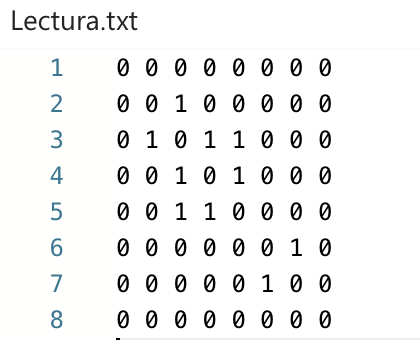

# Brain_Graph_Manipulation

## Introducción

### Descripción de la situación problema

El cerebro humano es como una red de neuronas que trabajan juntas para procesar información, generar pensamientos y coordinar acciones. A través de técnicas como la resonancia magnética funcional (fMRI) y la electroencefalografía (EEG), los científicos han avanzado en la comprensión de la actividad cerebral. 

Se destaca el uso de EEG, una técnica no invasiva y asequible que mide la actividad eléctrica cerebral, con electrodos colocados en el cuero cabelludo. La conectividad funcional en el EEG, que evalúa la correlación temporal entre las señales de diferentes regiones cerebrales, revelando cómo colaboran en tareas cognitivas.

Para el análisis de la conectividad funcional, se construye un grafo de conectividad que indica qué áreas colaboran en una tarea y en qué grado. El análisis de dicho grafo se realiza con técnicas computacionales clásicas, tales como recorridos en grafos, así como técnicas matemáticas avanzadas relacionadas con el manejo de grafos.

En esta situación problema nosotros seremos capaces de responder a las siguientes preguntas:

- ¿Qué algoritmos relacionados con grafos puedes utilizar para analizar una red de conectividad funcional?
- ¿De qué forma puedes visualizar el grafo de conectividad de tal forma que sea fácil de entender?
- ¿Qué dificultades hay en el análisis del grafo de conectividad?

 

 

Durante estas últimas 5 semanas hemos realizado el experimento del EEG sobre nosotros en 3 diferentes áreas, las cuales fueron: Capacidad de Memoria, Capacidad de Resolución de Operaciones y Capacidad de Lectura

 
Los resultados obtenidos fueron recibidos como una matriz de adyacencia de 0's y 1's para entender y poder graficar las conexiónes de cada uno de nuestros cerebros.

 

 

A continuación las etapas del proyecto:

## Etapa 01 - Registro de Señales de EEG

En esta etapa, participamos en una sesión experimental de neurociencia en la que se midió nuestra actividad cerebral utilizando un dispositivo de EEG (Unicorn Hybrid Black).

Durante la sesión, realizamos tres tipos de tareas cognitivas: lectura, memoria y operaciones matemáticas. Mientras realizamos estas tareas, se registró nuestra actividad cerebral, generando archivos de datos. Estos datos son representados como matrices que a su vez son grafos no ponderados que indican la presencia de una relación fuerte entre canales.

Graficamos todos los grafos de conectividad en 2D.

### Grafos de conectividad

#### Juan's Connectivity Graph

#### Diego's Connectivity Graph

#### Fer's Connectivity Graph

#### Jesus's Connectivity Graph

#### General S0A Graph Connected

## Etapa 02 - Análisis de caminos en los grafos de conectividad 

La etapa implica la transformación de grafos, la búsqueda de caminos utilizando diferentes métodos y la aplicación del algoritmo de Floyd para analizar las distancias mínimas entre todos los electrodos en los grafos

- Conversión a Grafos Ponderados
- Búsqueda de Caminos con BFS, DFS y Búsqueda de Costo Uniforme
- Búsqueda de Caminos para Grafo de 32 Electrodos
- Método de Floyd para Distancias Mínimas

## Etapa 03 - Análisis de árboles de mínima expansión de los grafos de conectividad

En esta etapa, se realiza la búsqueda de árboles de expansión mínima utilizando los grafos de conectividad no ponderados.

## Etapa 04 - Cascos convexos de los vértices de los árboles de mínima expansión

En esta etapa, se lleva a cabo la búsqueda de los cascos convexos para los vértices de cada árbol de expansión mínima

## Etapa 05 - Representación del grado de cada arista con diagramas de Voronoi

En esta etapa, se lleva a cabo un análisis de conectividad funcional utilizando diagramas de Voronoi.

- Cálculo del Grado de Cada Vértice
- Construcción de Diagramas de Voronoi
- Coloreado de Regiones en los Diagramas
- Dibujo de un Círculo Representando la Cabeza

## Conclusiones individuales

### Juan Salazar

Como lo vimos a lo largo de estas 5 semanas, creo que es evidente que cualquier cosa puede ser representada como un grafo, si nos ponemos a analizarlo, todas las personas y todo lo que existe en este mundo está cargado de diferentes tipos de información, la cual puede ser estudiada y analizada para obtener grandes resultados o descubrimientos. Los algoritmos que estudiamos nos ayudan a hacer posible el estudio de toda esta información de una manera eficiente tanto en capacidad de memoria como temporal.